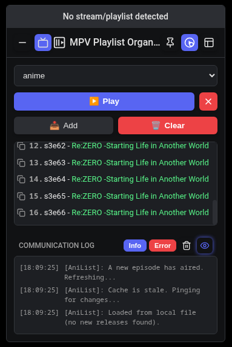
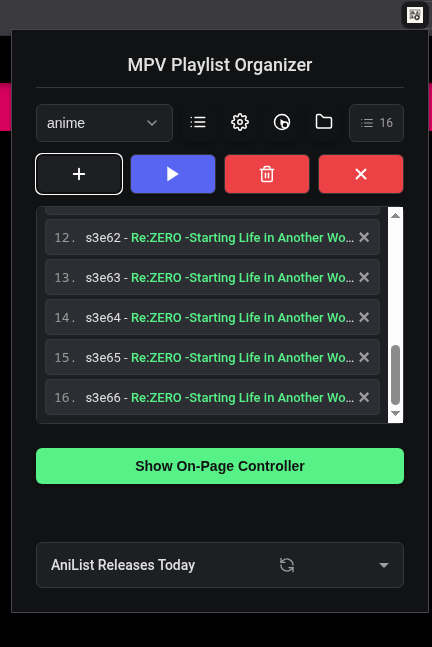
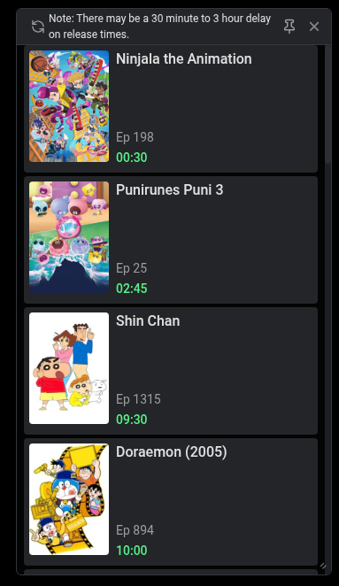
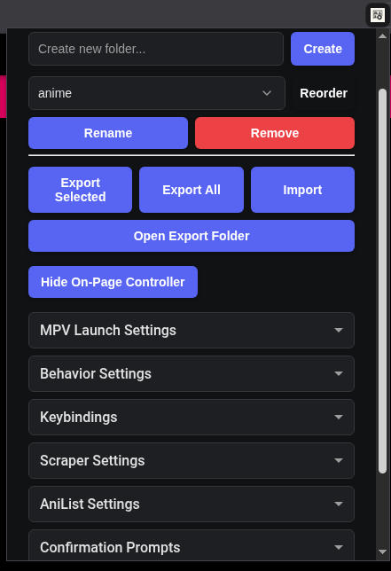

# MPV Playlist Organizer
'
[](https://opensource.org/licenses/MIT)
[](https://github.com/Mummykiller/mpv-playlist-organizer/releases)

A browser extension designed to capture video stream URLs (like M3U8) and YouTube links, organize them into persistent playlists, and play them directly in the [MPV media player](https://mpv.io/).

It features a draggable on-page UI, synchronization with a command-line interface, and robust controls for managing playback—all without leaving your browser.

> **Note on Development:** This extension was developed in collaboration with AI assistants, guided and directed by a human developer.

 

  

---

## Quick Start

1.  **Download & Unzip:** Download the latest release and unzip it to a **permanent location** (e.g., your home directory).
2.  **Run Installer:** Run `Installer.py` and follow the GUI prompts.
3.  **Load Extension:** Load the unzipped folder as an "unpacked extension" in your browser's extension page (e.g., `chrome://extensions`).
4.  **Connect:** Copy the extension's ID, paste it into the installer, and click "Install".
5.  **Restart:** Restart your browser completely.

For detailed instructions, see the full [Installation](#installation) section below.

---

## Installation

Installation involves downloading the project, running a setup script, and loading the extension in your browser.

### Prerequisites

-   **Supported Browsers:** Chromium-based browsers (e.g., Google Chrome, Microsoft Edge, Brave). Firefox is **not** currently supported.
-   **MPV Player:** You must have [MPV](https://mpv.io/installation/) installed.
-   **yt-dlp:** For YouTube playback, you must have [yt-dlp](https://github.com/yt-dlp/yt-dlp) installed and accessible in your system's `PATH`.
-   **Python:** Python 3.7+ is required to run the installer and native host.

### Step 1: Download the Project

Download the latest release from the **[Releases](https://github.com/Mummykiller/mpv-playlist-organizer/releases)** page and unzip it to a **permanent location** (e.g., your `Documents` or `home` folder).

> **⚠️ Do not run the installer from your `Downloads` folder.** The installation creates absolute paths to the scripts. If you move the folder later, the extension will stop working.

### Step 2: Execute the Installer GUI

The installer is a graphical user interface that configures your browser to communicate with the native host.

1.  Open a terminal or command prompt in the folder where you unzipped the project.
2.  Double-click the `Installer.py` file to execute it. If that doesn't work, execute it from your terminal:
    ```sh
    python3 Installer.py # On macOS/Linux
    python Installer.py  # On Windows
    ```
3.  The installer window will appear, asking for your **Extension ID**.

### Step 3: Load the Extension & Get the ID

1.  Go to your browser’s extensions page (e.g., `chrome://extensions`).
2.  Enable **Developer Mode**.
3.  Click **“Load unpacked”** and select the folder where you unzipped the project.
4.  The extension will appear in your list. **Copy its ID.**
5.  Paste the ID into the "Extension ID" field in the installer window and click **Install**.

### Step 4: Restart Your Browser

**Completely close and restart your browser** for it to recognize the newly registered native messaging host.

---

## Usage Guide

The extension provides three main ways to interact:

-   **On-Page Controller**: The main UI appears on web pages, allowing you to add detected URLs to a playlist, play, and clear. It can be minimized to a small button.
-   **Popup Menu**: Click the extension’s toolbar icon to view and manage the current playlist, manage all your folders (create, rename, remove), change settings, and see today's anime releases from AniList.
-   **Context Menu**: Right-click on a link, video, or page to quickly add it to a playlist without using the main UI.

A **Command-Line Interface (CLI)** is also available for playing your playlists from the terminal.

---

## Core Features
-   **Sequential Playback Queue**: Stack multiple videos or entire playlists to be played one after another in the same MPV instance, with per-item settings applied correctly.
-   **Session Restoration**: The extension can reconnect to your MPV instance even if you close and reopen your browser.
-   **Smart Title Scraping**: Automatically creates clean, readable titles from web pages (e.g., `s01e05 - Show Name`).
-   **Advanced Site Support**: Includes a dynamic bypass script system (e.g., for AnimePahe) that is automatically configured by the installer based on your browser choice for handling sites that require special headers or cookies.
-   **Popup Playlist**: View and manage the active playlist directly from the extension's popup icon.
-   **Playlist Management**: Create multiple playlists (which are called "folders" in the UI) and easily switch between them.
-   **Import/Export**: Back up your playlists to JSON files and import them later.
-   **AniList Integration**: See today's airing anime in a draggable, resizable side-panel or in the popup.
-   **Highly Configurable**: Adjust the UI, playback behavior, confirmation prompts, and more from the settings menu.
-   **Terminal Support**: Use the `--terminal` flag in settings to launch MPV with a visible console window for debugging playback issues (supported on Windows and Linux).
-   **Customizable Keybindings**: Set global shortcuts for adding videos, toggling the UI, and opening the popup.
-   **SPA Resilience**: The UI works seamlessly on modern Single-Page Applications like YouTube.
-   **Manageable Automatic Flags**: The extension's default MPV flags (e.g., `--force-window`) can be disabled or re-enabled through the settings, giving you more control over MPV's behavior.

---

## Command-Line Interface (CLI)

The extension includes a powerful CLI for managing and playing playlists directly from your terminal.

### Setup

During installation, the setup script offers to create a wrapper named `mpv-cli` in a user-writable scripts directory (e.g., `~/.local/bin` on Linux). Once this directory is in your system's `PATH`, you can invoke the CLI from any terminal session.

### Usage Example

To play a playlist named "My Watchlist", run:

```sh
mpv-cli "My Watchlist"
```

The command will find the playlist, launch MPV, and start playing its contents, creating a session that can be controlled by the browser extension.

---

## How It Works

The extension consists of two parts: a **browser extension** (the UI) and a **native host** (a Python script). The extension sends messages to the native host, which then launches and controls MPV. This bridge allows for powerful features like live playlist syncing and session management.

---

## Limitations / Known Constraints

-   **Absolute Paths:** The installer uses absolute paths. You **cannot move the project folder** after installation without re-running the installer.
-   **Browser Support:** This extension is tested and supported on Chromium-based browsers (Google Chrome, Microsoft Edge, Brave). Firefox is **not currently supported** due to differences in the WebExtensions API for native messaging.
-   **No Concurrent Playback:** The native host can only manage one MPV instance at a time. Starting a new playlist will close any active session.
-   **URL Detection:** The extension primarily detects M3U8/MPD stream manifests and YouTube URLs. It may not capture all video types on all websites.

---

## Troubleshooting

<details>
  <summary><strong>Click to see common problems and solutions...</strong></summary>

  **Problem: The log shows "Native host disconnected".**
  *   **Solution:** Make sure you have **completely restarted your browser** after running the installer. Also, ensure you have not moved the project folder after installation.

  **Problem: MPV doesn't launch when I click Play.**
  *   **Solution:** The installer should prompt you to locate your `mpv.exe` if it can't find it. You can also manually set the path in the `data/config.json` file. On Linux/macOS, ensure `mpv` is in your system's `PATH`.

  **Problem: The AniList feature is not working or shows SSL errors.**
  *   **Solution:** This can happen on corporate networks. Place the required certificate authority file named `ca.pem` inside the `data` directory within the extension folder.

</details>

---

## License

Available under the [MIT License](https://opensource.org/licenses/MIT).