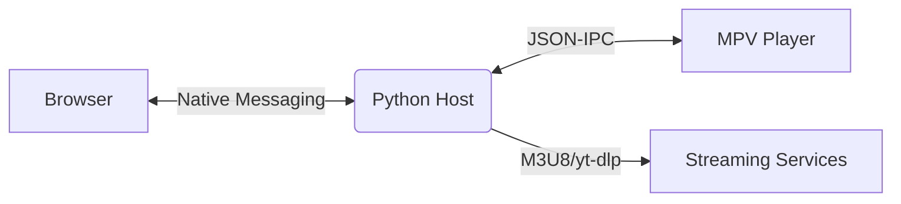

# 🎬 MPV Playlist Organizer

**A powerful browser extension for capturing video streams and managing playlists with MPV**

[Quick Start](#-quick-start) • [Features](#-core-features) • [Installation](#-installation) • [Usage](#-usage-guide) • [CLI](#-command-line-interface)

---

## 📋 Overview

MPV Playlist Organizer is a browser extension that captures video stream URLs (M3U8, MPD) and YouTube links, organizes them into persistent playlists, and plays them directly in the [MPV media player](https://mpv.io/). 

Experience seamless video management with a draggable on-page UI, **real-time session synchronization**, and **precise resume tracking**—all without leaving your browser.

> **Development Note:** This extension was developed through human-AI collaboration, combining AI assistance with human direction and oversight.

### 📸 Screenshots

| On-Page Controller | Popup Interface |
|:------------------:|:---------------:|
|  |  |

| AniList Integration | Settings Panel |
|:-------------------:|:--------------:|
|  |  |

---

## 🚀 Quick Start

Get up and running in 5 simple steps:

1. **📥 Download** — Get the latest release and unzip to a **permanent location**.
2. **🔧 Install** — Run `installer.py` and follow the GUI prompts.
3. **🧩 Load Extension** — Add the unpacked extension in your browser (`chrome://extensions`).
4. **🔗 Connect** — Click **"Detect"** in the installer to automatically find your ID (or paste it manually) and click **"Install"**.
5. **♻️ Restart** — **Completely restart your browser** to register the native host.

📚 [Detailed installation instructions](#-installation)

---

## ✨ Core Features

### 🎯 Advanced Playback & Queue
- **Precise Resume Tracking** — Tracks your position down to the second. Uses the `--start` flag to bypass inconsistent network stream resumes.
- **Smart Order Restoration** — Launch any episode in a playlist; the extension automatically "reconstructs" the surrounding context in the player queue.
- **Sequential Playback Queue** — Stack multiple videos to play consecutively in the same MPV instance.
- **Session Restoration** — Reconnect to your active MPV instance even after closing your browser.
- **Native M3U Enrichment** — Generates metadata-rich M3U playlists to guarantee title preservation and playback stability.

### 🎨 Intelligent User Interface
- **Draggable Controller** — A floating on-page UI that snaps to corners and can be minimized to a discreet button.
- **AniList Dashboard** — A dedicated, draggable panel showing today's airing anime with integrated search and playback.
- **Popup Playlist Manager** — Quick access to your folders, settings, and full queue from the browser toolbar.
- **SPA Compatibility** — Native support for modern Single-Page Applications (YouTube, etc.) via MutationObservers.

### ⚡ Live Interaction
- **Real-Time Sync** — Adding, removing, or reordering items in the browser UI can instantly update the running MPV instance via JSON-IPC.
- **Context Menu Integration** — Right-click any link, video, or thumbnail to add it instantly to your preferred folder.
- **Double-Click Title Copy** — Quickly copy video titles directly from the playlist UI for easy sharing or searching.

### 🔧 Power User Features
- **One-Click ID Detection** — The installer can automatically detect your Extension ID by scanning your browser profiles.
- **Browser Cookie Sync** — Uses your browser's cookies (Chrome/Brave/Edge/Vivaldi) for YouTube playback to support watch history, subscriptions, and private videos.
- **yt-dlp Auto-Update** — Detects when `yt-dlp` is outdated (fixing 410 Gone errors) and offers a one-click automatic update.
- **The Janitor** — Built-in automated cleanup that wipes temporary M3U files and stale IPC sockets on startup.
- **Customizable Keybindings** — Set global browser shortcuts for Adding, Playing, or Toggling the UI.

---

## 💻 Command-Line Interface

The extension includes a powerful CLI wrapper for managing your media without opening a browser.

### Usage Examples

| Command | Description |
|---------|-------------|
| `mpv-cli list` | Lists all available folders and their item counts |
| `mpv-cli play "Watchlist"` | Launches MPV with the specified playlist |

### Setup
1. Open `installer.py` and click **"Install CLI Wrapper"**.
2. Click **"Add Folder to User PATH"** (Windows) or follow the manual instructions for `~/.bashrc` / `~/.zshrc` (Linux/macOS).

---

## 📦 Installation

### Prerequisites

| Requirement | Description |
|-------------|-------------|
| **Browser** | Chromium-based (Chrome, Edge, Brave, Vivaldi) — *Firefox not supported* |
| **MPV Player** | [Download here](https://mpv.io/installation/) — Must be in PATH or selected in installer |
| **yt-dlp** | [Install guide](https://github.com/yt-dlp/yt-dlp) — Required for YouTube & Bypass |
| **Python** | Python 3.7+ (ensure `tkinter` is installed on Linux) |

---

## ⚙️ How It Works

The extension uses a **secure three-tier architecture**:

1. **Browser Extension (UI)**: Captures URLs and manages the user state.
2. **Native Messaging Host (Python)**: A bridge that handles file I/O, `yt-dlp` resolution, and MPV process management.
   - **Windows Process Name**: `mpv playlist organizer` (visible in Task Manager Processes tab).
   - **Linux Process Name**: `mpv-pl-organize` (visible in `top`, `htop`, or System Monitor).
3. **MPV Media Player**: The playback engine, controlled via a **JSON-IPC socket**.

```mermaid
graph LR
    A[Browser] <-->|Native Messaging| B(Python Host)
    B <-->|JSON-IPC| C[MPV Player]
    B -->|M3U8/yt-dlp| D[Streaming Services]
```

---

## 🔧 Troubleshooting

<strong>🔍 Run Diagnostics</strong>

If you encounter issues, open `installer.py` and click **Run Diagnostics**. This verifies:
- ✅ MPV & yt-dlp installation/version
- ✅ ffmpeg presence
- ✅ Browser cookie access permissions

<strong>🔌 Native Host Disconnected</strong>

- **Completely restart your browser** after installation.
- Verify you haven't moved the project folder after running the installer.
- Ensure the extension ID in the installer matches the one in `chrome://extensions`.

<strong>🐧 Linux Specifics</strong>

If the installer GUI doesn't open, ensure you have the `python3-tk` package installed:
`sudo apt install python3-tk` (Ubuntu/Debian) or `sudo pacman -S tk` (Arch).

---

## 🤝 Contributing & License

Contributions are welcome! This project is licensed under the **MIT License**.

**Made with ❤️ for the MPV community**

[⭐ Star on GitHub](https://github.com/Mummykiller/mpv-playlist-organizer) • [🐛 Report Bug](https://github.com/Mummykiller/mpv-playlist-organizer/issues) • [💡 Request Feature](https://github.com/Mummykiller/mpv-playlist-organizer/issues)

