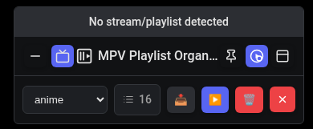
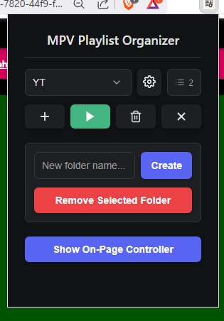

# MPV Playlist Organizer

[](https://opensource.org/licenses/MIT)
[](https://github.com/Mummykiller/mpv-playlist-organizer/releases)
<!-- You can add more badges here, e.g. CI, downloads, etc. -->

A browser extension designed to capture video stream URLs (like M3U8) and YouTube links, organize them into persistent playlists, and play them directly in the [MPV media player](https://mpv.io/).

It features a draggable on-page UI, synchronization with a command-line interface, and robust controls for managing playback—all without leaving your browser.

> **Note on Development:** This extension was developed through a unique collaboration between a human and AI assistants. The core logic, UI design, and feature implementation were primarily written by different AI models, guided and directed by **shinku**.

    
<!-- Replace 'assets/screenshot.png' with the actual path to your screenshot -->

---

## Table of Contents

- [Why MPV Playlist Organizer?](#why-mpv-playlist-organizer)
- [Features](#features)
- [How It Works](#how-it-works)
- [Troubleshooting](#troubleshooting)
- [Installation](#installation)
- [Usage Guide](#usage-guide)
- [Settings Explained](#settings-explained)
- [Limitations](#limitations)
- [Contributing](#contributing)
- [Project Structure](#project-structure)
- [License](#license)

---

## Why MPV Playlist Organizer?

Tired of the tedious process of finding, copying, and manually opening stream URLs in a terminal?

1.  Find a stream or video URL.
2.  Copy it.
3.  Open a terminal and type `mpv "..."`.
4.  Repeat for every video.

This extension streamlines your workflow. It acts as a bridge between your browser and your favorite media player, allowing you to build and play playlists on the fly—without ever leaving your browser.

---

## Features

<details>
  <summary><strong>Click to see the full feature list...</strong></summary>

#### 🔍 Stream & Video Detection
- **Automatic URL Detection**: Finds M3U8 streams and YouTube video pages, even on Single-Page Applications (SPAs).
- **Advanced Title Scraping**: Intelligently scrapes page content to create clean, descriptive titles (e.g., `s01e05 - Show Name`), with configurable filter words to remove junk.
- **Manual Stream Scanner**: Context menu helper to capture streams on tricky sites.

#### 📂 Playlist & Folder Management
- **Full Folder Control**: Create, rename, and remove playlists (folders) from the popup.
- **Drag-and-Drop Reordering**: Reorder folders in the popup and playlist items in the on-page UI.
- **Copy URL/Title**: Quickly copy an item's URL or title directly from the playlist.

#### 🚀 Powerful MPV Integration
- **Direct Playback & Live Sync**: Send a playlist to MPV and append new items live without interrupting playback.
- **Launch Customization**: Control window size and add custom command-line flags for MPV.
- **Smart Session Handling**: Prevents multiple managed instances and can reconnect to an existing session.
- **Automatic Clearing**: Option to clear a playlist after it finishes playing (requires Lua script).
- **yt-dlp Update Options**: Choose to automatically update `yt-dlp` on playback failure, be prompted to update, or disable automatic updates. Includes a manual update button.

#### ✨ Flexible User Interface
- **Multiple UI Modes**: Switch between a full-featured controller, a compact single-line UI, or a draggable minimized button.
- **Draggable, Pinnable & Resizable**: Move the UI anywhere, lock its position, and resize the AniList side-panel.
- **Persistent State**: Remembers its position, mode, and settings across sessions.
- **Fullscreen Aware**: Hides automatically when a video enters fullscreen.

#### 🛠️ Workflow & Productivity Tools
- **AniList Integration**: View today's anime releases in the popup or a draggable, resizable side-panel. Features caching, customizable art size, and panel snapping.
- **Dual-Role Popup**: Acts as a mini-controller when the on-page UI is minimized, or a full management hub when it's visible.
- **Context Menu & CLI**: Add URLs via right-click or play saved playlists from your terminal.

#### 🛡️ Smart & Configurable Behavior
- **Duplicate Handling**: Choose to be asked, always add, or never add duplicate URLs.
- **Granular Confirmations**: Toggle confirmation prompts for all destructive actions.
- **Robust SPA Support**: UI persists through client-side navigations on sites like YouTube.
- **One-Click Add**: Enable a top-level context menu item to add URLs to your last-used folder.

#### 🔄 Data Portability
- **Export & Import**: Export/import playlists as JSON files.
- **CLI Data Sync**: Playlist data is stored locally, keeping the extension and CLI in sync.

</details>

---

## How It Works

The extension consists of two main parts:

1. **The Browser Extension**:  
   This is the UI you see in your browser. It detects video URLs, manages your playlists in the browser’s local storage, and displays the on-page controller.
2. **The Native Host**:  
   This is a Python script running on your computer. Since browsers can’t start MPV directly for security reasons, the extension sends messages (like “play this playlist”) to the native host, which then launches and controls MPV. It even uses a small helper script (`on_completion.lua`) to detect when a playlist finishes naturally.

This setup ensures a secure and powerful connection between your browser and your local system.

---

## Troubleshooting

<details>
  <summary><strong>Click to see common problems and solutions...</strong></summary>

  **Problem: The log shows "Native host disconnected" or "Error communicating with native host".**
  *   **Solution 1:** Make sure you have **completely restarted your browser** after running the installer. Closing all windows is essential.
  *   **Solution 2:** You may have moved or deleted the extension folder after installation. The native host path is absolute. You must run `install.py` again from the new, permanent location.
  *   **Solution 3:** Ensure Python 3 is correctly installed and accessible from your terminal.

  **Problem: MPV doesn't launch when I click Play.**
  *   **Solution (Windows):** The installer may not have found `mpv.exe`. Open the `config.json` file inside the project folder and make sure the `mpv_path` points to your `mpv.exe`. You can edit this path manually and save the file.
  *   **Solution (Linux/macOS):** The `mpv` command must be in your system's `PATH`. Open a terminal and type `which mpv`. If it doesn't return a path, you need to install MPV correctly or add its location to your `PATH`.

  **Problem: The controller UI doesn't appear on a web page.**
  *   **Solution:** For security reasons, browser extensions cannot run on certain pages (like `chrome://...` pages or the Chrome Web Store). Please try navigating to a regular website like YouTube. If it still doesn't appear, try reloading the extension from your browser's extensions page.
</details>

---

## Installation

Installation involves installing the browser extension and running a setup script to allow the browser to communicate with MPV.

> **Note for macOS Users:** While the installation scripts include logic for macOS, this functionality has not been tested. It is provided on a best-effort basis and may require manual adjustments to work correctly.

### Prerequisites

- **MPV Player:**  
  You must have [MPV](https://mpv.io/installation/) installed. For easier command-line use, add its directory to your system’s PATH (not strictly required).

  <details>
    <summary>How to Add <code>mpv.exe</code> to Your PATH on Windows</summary>
 
    1. **Find your MPV folder:**  
       Locate where you extracted or installed `mpv.exe` (e.g., `C:\Tools\mpv\mpv.exe`).
    2. **Copy the folder path:**  
       Click the address bar in File Explorer, and copy the folder path (e.g., `C:\Tools\mpv`).
    3. **Open System Properties:**  
       - Press <kbd>Win</kbd> + <kbd>Pause/Break</kbd>, or  
       - Right-click “This PC” → Properties → Advanced system settings.
    4. **Edit Environment Variables:**  
       - Click “Environment Variables…”  
       - In the “System variables” section, scroll to Path and click “Edit…”  
       - Click “New” and paste the folder path you copied.
    5. **Apply and restart:**  
       - Click “OK” to save, then restart any command prompts or your PC for changes to take effect.

    You can now run `mpv` from any command prompt window.
  </details> 

- **yt-dlp (for YouTube Playback):**  
  MPV relies on `yt-dlp` to resolve and play YouTube URLs. You must have yt-dlp installed and accessible in your system's PATH.
  
  > **Important:** YouTube frequently changes its backend, which can break playback. It is crucial to **keep `yt-dlp` updated regularly**. 
  > 
  > - If you installed the standalone executable, run `yt-dlp -U`.
  > - The extension also includes a feature to automatically ask to update or auto-update `yt-dlp` upon playback failure. This can be configured in the settings.
  > - If you installed it via a package manager (like `pip` or `brew`), use its specific update command (e.g., `pip install --upgrade yt-dlp`).

- **Python:**  
  Python 3.7+ is required to run the installation script.

- **Terminal/Command Prompt:**  
  You will need to open a command-line interface to run the installer.
  - **Windows:** Command Prompt, PowerShell, or Windows Terminal.
  - **macOS/Linux:** Terminal.
---

### Step 1: Download the Project

Download the latest release from the **[Releases](https://github.com/Mummykiller/mpv-playlist-organizer/releases)** page and unzip it to a **permanent location** (e.g., your `Documents` or `home` folder).

> **⚠️ Do not run the installer from your `Downloads` folder.**  
> The installation creates absolute paths to the scripts. If you move or delete the folder later, the extension will stop working.

---

### Step 2: Run the Installer GUI

The installer configures your browser to communicate with the native host.

1. Open a terminal or command prompt in the folder where you unzipped the project.
2. Double-click the `Installer.py` file to run it. If that doesn't work, run it from your terminal:
   ```sh
   python3 Installer.py # On macOS/Linux
   python Installer.py  # On Windows
   ```
3. The installer window will appear, asking for your **Extension ID**.

---

### Step 3: Load the Extension & Get the ID

This extension is loaded as an “unpacked” extension.

<details>
  <summary>Help finding the Extension ID</summary>

  - **Chrome / Edge / Brave / Chromium:**
    The ID is a long string of letters on the extension’s card.
</details>

---

### Step 4: Install the Native Host

1. Go to your browser’s extensions page (e.g., `chrome://extensions` or `about:addons`) and enable **Developer Mode**.
2. Click **“Load unpacked”** and select the folder where you unzipped the project.
3. The extension will appear in your list. **Copy its ID.**
4. Paste the ID into the "Extension ID" field in the installer window and click **Install**.

---

### Step 5: Restart Your Browser

**Completely close and restart your browser** for it to recognize the newly registered native messaging host.

---

## Usage Guide

### Browser Extension

The extension provides several ways to interact:

- **On-Page Controller**: The main UI appears on web pages.
  - **Status Banner:** Shows whether a stream has been detected. Click and drag to move the UI.
  - **Add:** Adds the detected stream or current YouTube page URL to the selected playlist.
  - **Play:** Sends the current playlist to MPV. If MPV is already playing from the same folder, new items are added to the queue live.
  - **Clear:** Empties the current playlist.
  - **Close MPV:** Gracefully closes the MPV instance launched by the extension.
  - **Folder Dropdown:** Switch between different playlists.
- **Popup Menu**: Click the extension’s browser toolbar icon to:
  - Create, rename, or remove folders.
  - Reorder your folders via drag-and-drop.
  - Set the launch window size for MPV (e.g., 720p, 1080p, or custom).
  - Access a full-featured mini-controller if the on-page UI is minimized.
- **Context Menu**: Right-click on a link, video, or page and select "Add to MPV Folder" to quickly save a URL without using the main UI.

### Command-Line Interface (CLI)

The native host script also provides a command-line interface for managing and playing playlists directly from your terminal.

To use it, **navigate to the project directory** in your terminal and run one of the available commands.

**Commands:**

-   `play [folder_name]`: Plays the playlist from the specified folder.
    ```sh
    # Example: Play the playlist saved in the "YT" folder
    python3 native_host.py play YT
    ```

-   `list`: Lists all available folders and the number of items in each.
    ```sh
    # Example: List all available folders
    python3 native_host.py list
    ```

---

## Settings Explained

All settings are accessible from the **Settings** section of the browser toolbar popup menu.

<details>
  <summary><strong>MPV Launch Settings</strong></summary>

  - **Window Size**: Choose a preset window size (e.g., 720p, 1080p) or "Custom" for MPV.
  - **Custom MPV Flags**: Add any command-line arguments (e.g., `--vo=gpu --hwdec=auto`).
  - **Show "Play New" Button**: Toggles a button to launch a separate, unmanaged MPV instance.
</details>

<details>
  <summary><strong>Behavior Settings</strong></summary>

  - **Duplicates**: Controls behavior for adding duplicate URLs (`Ask`, `Always Add`, `Never Add`).
  - **Default UI**: Sets the default state of the on-page controller (`Full`, `Compact`, or `Minimized`).
  - **One-click Add**: Adds a top-level context menu item to add a URL to the last-used folder.
  - **Scanner Timeout (s)**: Sets how long the manual stream scanner waits before giving up.
  - **Clear on Completion**: If checked, auto-clears the playlist after the last item finishes in MPV.
  - **Auto-focus Input**: Automatically focuses the "Create new folder" input in the popup.
  - **Double-click to Copy**: Allows double-clicking a playlist item to copy its title.
  - **Show Minimized Button**: Toggles the visibility of the circular button when the UI is minimized.
  - **Show Copy Title Button**: Toggles a button next to each playlist item to copy its URL.
  - **On YT Playback Failure**: Action to take if YouTube playback fails (`Do Nothing`, `Ask to Update`, `Auto-Update`).
</details>

<details>
  <summary><strong>AniList Settings</strong></summary>

  - **Enable AniList Integration**: Master switch for all AniList features.
  - **Show UI Sections**: Toggles AniList sections in the popup and on-page controller.
  - **Snap Panel on Open**: Automatically snaps the AniList side-panel to the controller when opened.
  - **Force Re-attach Panel**: One-time action to snap a moved panel back to the controller.
  - **Lock Panel**: Locks the AniList panel to the controller, preventing separate dragging.
  - **Cover Image Size**: Slider to adjust the size of anime cover art.
  - **Disable Cache**: Forces fresh data from the AniList API, bypassing the 30-minute cache.
</details>

<details>
  <summary><strong>Scraper Settings</strong></summary>

  - **Custom Filter Words**: Add your own list of words (e.g., "official video", "4k") to be automatically removed from scraped titles, in addition to the built-in filters.
</details>

<details>
  <summary><strong>Confirmation Prompts</strong></summary>

  This section allows you to individually enable or disable confirmation dialogs for potentially destructive actions.

  - **Confirm Delete**: Asks "Are you sure?" before deleting a folder.
  - **Confirm Clear**: Asks for confirmation before clearing a playlist.
  - **Confirm Close**: Asks for confirmation before closing a running MPV instance.
  - **Confirm "Play New"**: Asks for confirmation before launching a new, separate MPV instance.
</details>

---

## Limitations

- **M3U8 Stream Detection:**  
  The extension detects `.m3u8` stream URLs by listening for common network requests. However, many modern streaming sites use techniques to protect their videos, such as:
  - Obfuscated JavaScript (hiding the stream URL in complex code)
  - Blob URLs or WebSockets (serving video data in chunks without a direct URL)- Digital Rights Management (DRM)
  
  On sites using these methods, the extension may be unable to find a playable URL. This is a fundamental limitation; circumventing DRM or heavily obfuscated code is beyond the scope of this project.

- **"Clear on Completion" Feature**: This feature requires the browser to remain open for the entire duration of the playlist. If you close the browser while MPV is playing, the extension cannot detect when the playlist finishes and will not be able to clear it.

---

## Uninstalling

To completely remove the extension and its native host components, use the installer GUI and then remove the extension from your browser.

1.  **Run the Uninstaller.**
    - Run `Installer.py` again.
    - Click the **Uninstall** button.
 
2.  **Remove the Browser Extension.**
    Go to your browser’s extensions page (e.g., `chrome://extensions`), find "MPV Playlist Organizer," and click **Remove**.

3.  **Delete the Project Folder.**
    Once the script finishes and the extension is removed, you can safely delete the entire project folder.

---

## Contributing

<details>
  <summary><strong>Want to contribute? Click here...</strong></summary>

  This is a personal project, but contributions are welcome! If you have an idea for a new feature, found a bug, or want to improve the code:

  1. **Open an Issue:**  
     Describe the bug or feature proposal.
  2. **Discuss:**  
     We can refine the idea or bug report together.
  3. **Fork and Submit a PR:**  
     Fork the repository, make your changes, and submit a pull request.

  Please make sure your code is well-documented and tested. See the Project Structure section below for guidance.
</details>

---

## Project Structure

<details>
  <summary><strong>Click to see the project file structure...</strong></summary>

  The project is contained within a single directory.

  #### Core Files (Shipped in Release)
  - `README.md` — Project documentation (this file).
  - `manifest.json` — Defines the browser extension's capabilities and properties.
  - `install.py` — The Python script to set up the native messaging host.
  - `uninstall.py` — The Python script to cleanly remove the native messaging host.
  - `native_host.py` — The Python script that acts as the bridge between the browser and MPV.
  - `on_completion.lua` — A helper script for MPV to detect when a playlist finishes naturally.
  - `anilist_releases.py` — A helper script to fetch release data from the AniList API.
  - `background.js` — The extension's service worker; handles state management and communication.
  - `content.js` — Injected into web pages to provide the on-page UI.
  - `popup.js` — Logic for the extension's toolbar popup menu.
  - `content.css`, `popup.css`, `popup.html` — Style and structure for the UI components.
  - `images/` — Contains icons and screenshots for the README.

  #### Generated Files (Created after installation and use)
  All generated files are now stored inside the `data/` directory to keep the root folder clean.
  - `data/config.json` — (Windows only) Stores the path to `mpv.exe` if found by the installer.
  - `data/folders.json` — Stores all your created playlists ("folders") and their URLs.
  - `data/session.json` — Stores information about the currently running MPV session for persistence.
  - `data/anilist_cache.json` — Caches data from the AniList API to reduce network requests.
  - `data/native_host.log` — A log file for troubleshooting the native host script.
  - `data/exported/` — A directory where all exported playlists are saved.
  - `run_native_host.bat` — (Windows only) A wrapper script to ensure the correct Python interpreter is used.
  - `chrome-manifest.json`, `firefox-manifest.json`, etc. — Browser-specific manifest files created by `install.py`.
</details>

---

## License

This project is open-source and available under the [MIT License](https://opensource.org/licenses/MIT).
