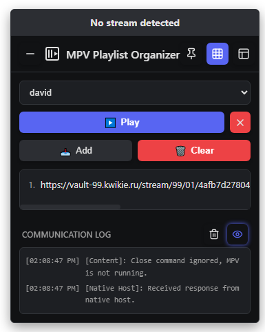
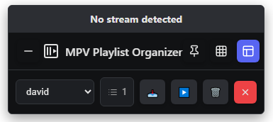
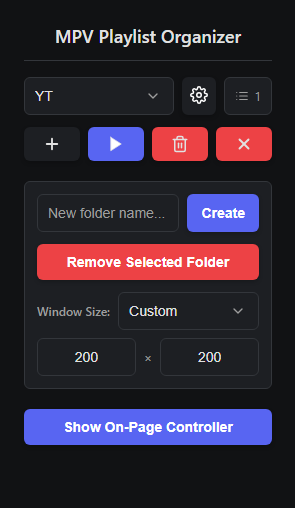

# MPV Playlist Organizer

[](https://opensource.org/licenses/MIT)
[](https://github.com/Mummykiller/mpv-playlist-organizer/releases)
<!-- You can add more badges here, e.g. CI, downloads, etc. -->

A browser extension designed to capture video stream URLs (like M3U8) and YouTube links, organize them into persistent playlists, and play them directly in the [MPV media player](https://mpv.io/).

It features a draggable on-page UI, synchronization with a command-line interface, and robust controls for managing playback—all without leaving your browser.

> **Note on Development:** This extension was developed through a unique collaboration between a human and several AI assistants. The core logic, UI design, and feature implementation were primarily written by different AI models, guided and directed by **shinku**.

    
<!-- Replace 'assets/screenshot.png' with the actual path to your screenshot -->

---

## Table of Contents

- [Why MPV Playlist Organizer?](#why-mpv-playlist-organizer)
- [Features](#features)
- [How It Works](#how-it-works)
- [Installation](#installation)
- [Usage Guide](#usage-guide)
- [Limitations](#limitations)
- [Contributing](#contributing)
- [Project Structure](#project-structure)
- [License](#license)

---

## Why MPV Playlist Organizer?

If you frequently watch content from various sources (live streams, video hosting sites, YouTube, etc.) and prefer the high-quality, resource-efficient playback of MPV, you’ve probably faced the tedious process of:

1. Finding a stream or video URL.
2. Copying it.
3. Opening a terminal.
4. Typing `mpv "..."`.
5. Repeating for every single video.

This extension streamlines your workflow. It acts as a bridge between your browser and your favorite media player, allowing you to build and play playlists on the fly—without ever leaving your browser.

---

## Features

- 🔍 **Automatic Stream Detection**: Intelligently finds M3U8 video streams and recognizes YouTube video pages. Works seamlessly on Single-Page Applications (SPAs).
- 📂 **Multi-Playlist Management**: Organize links into multiple, named playlists (called “folders”) that persist across sessions.
- 🚀 **Direct to MPV**: Send an entire playlist to MPV with a single click.
- ⚡ **Live Playlist Sync**: Add new items to a folder, and they are automatically appended to the live MPV playlist without interrupting playback.
- ⚙️ **Customizable Launch Options**: Control how MPV launches with options to set the window size (e.g., 360p, 720p, 1080p, or a custom resolution).
- 🖐️ **Draggable & Customizable UI**: The on-page controller can be moved, pinned, minimized, or switched to a compact mode. Its position, mode, and state are saved and synced across all tabs.
- ✨ **Popup Mini-Controller**: When the on-page UI is minimized, the extension's toolbar icon provides a fully functional mini-controller for quick access.
- 🖱️ **Context Menu Integration**: Right-click on links, videos, or pages to add them directly to any of your folders.
- 🛡️ **Robust Session Management**: Prevents multiple MPV instances and can automatically reconnect to an existing session. Intelligently checks if MPV is running before performing actions to prevent errors.
- 👍 **Smart Confirmations**: Warns you before adding a duplicate URL to a playlist and confirms before closing a running MPV instance, preventing accidental clicks.
- 💾 **Saves Playback Position**: Leverages MPV’s `save-position-on-quit` feature, even when closed remotely.
- 💻 **CLI Integration**: Includes a command-line interface to play your saved playlists directly from the terminal.
- 🔄 **Data Sync**: Playlist data is stored in a local `folders.json` file, keeping the extension and CLI in sync.

---

## How It Works

The extension consists of two main parts:

1. **The Browser Extension**:  
   This is the UI you see in your browser. It detects video URLs, manages your playlists in the browser’s local storage, and displays the on-page controller.
2. **The Native Host**:  
   This is a Python script running on your computer. Since browsers can’t start MPV directly for security reasons, the extension sends messages (like “play this playlist”) to the native host, which t[...]

This setup ensures a secure and powerful connection between your browser and your local system.

---

## Installation

Installation involves installing the browser extension and running a setup script to allow the browser to communicate with MPV.

### Prerequisites

- **MPV Player:**  
  You must have MPV installed. For easier command-line use, add its directory to your system’s PATH (not strictly required).

  <details>
    <summary>How to Add <code>mpv.exe</code> to Your PATH on Windows</summary>

    1. **Find your MPV folder:**  
       Locate where you extracted or installed `mpv.exe` (e.g., `C:\Tools\mpv\mpv.exe`).
    2. **Copy the folder path:**  
       Click the address bar in File Explorer, and copy the folder path (e.g., `C:\Tools\mpv`).
    3. **Open System Properties:**  
       - Press <kbd>Win</kbd> + <kbd>Pause/Break</kbd>, or  
       - Right-click “This PC” → Properties → Advanced system settings.
    4. **Edit Environment Variables:**  
       - Click “Environment Variables…”  
       - In the “System variables” section, scroll to Path and click “Edit…”  
       - Click “New” and paste the folder path you copied.
    5. **Apply and restart:**  
       - Click “OK” to save, then restart any command prompts or your PC for changes to take effect.

    You can now run `mpv` from any command prompt window.
  </details>

- **yt-dlp (for YouTube Playback):**  
  MPV relies on `yt-dlp` to resolve and play YouTube URLs. You must have `yt-dlp` installed and accessible in your system's PATH.
  
  > **Important:** YouTube frequently changes its backend, which can break playback. It is crucial to **keep `yt-dlp` updated regularly**. 
  > 
  > - If you installed the standalone executable, run `yt-dlp -U`.
  > - If you installed it via a package manager (like `pip` or `brew`), use its specific update command (e.g., `pip install --upgrade yt-dlp`).

- **Python:**  
  Python 3.7+ is required to run the installation script.

---

### Step 1: Download the Project

Download the latest release from the **[Releases](https://github.com/Mummykiller/mpv-playlist-organizer/releases)** page and unzip it to a **permanent location** (e.g., your `Documents` or `home` folder).

> **⚠️ Do not run the installer from your `Downloads` folder.**  
> The installation creates absolute paths to the scripts. If you move or delete the folder later, the extension will stop working.

---

### Step 2: Run the Installer

The installer script configures your browser to communicate with the native host.

1. Open a terminal or command prompt in the folder where you unzipped the project.
2. Run the installer script:
    ```sh
    python3 install.py
    ```
    *(On Windows, you may need to use `python` or simply double-click `install.py`.)*
    > **Tip:** An easy alternative is to type `python3` (or `python`) into your terminal, press space, and then drag the `install.py` file from your file explorer into the terminal window. Press Enter to run it. This avoids having to navigate to the folder first.

3. The script will prompt you for your **Extension ID** (next step).

---

### Step 3: Load the Extension & Get the ID

This extension is loaded as an “unpacked” extension.

1. Go to your browser’s extensions page (e.g., `chrome://extensions` or `about:addons`).
2. Enable **Developer Mode**.
3. Click **“Load unpacked”**.
4. Select the folder where you unzipped the project.
5. The extension will now appear in your list. **Copy its ID.**

<details>
  <summary>Help finding the Extension ID</summary>

  - **Chrome / Edge / Brave / Chromium:**
    The ID is a long string of letters on the extension’s card.
</details>

---

### Step 4: Finish Installation

1. Return to your terminal where the installer script is waiting.
2. Paste the Extension ID you copied and press Enter.
3. The script will confirm creation of the necessary manifest files.

---

### Step 5: Restart Your Browser

**Completely close and restart your browser** for it to recognize the newly registered native messaging host.

---

## Usage Guide

### Browser Extension

The extension provides several ways to interact:

- **On-Page Controller**: The main UI appears on web pages.
  - **Status Banner:** Shows whether a stream has been detected. Click and drag to move the UI.
  - **Add:** Adds the detected stream or current YouTube page URL to the selected playlist.
  - **Play:** Sends the current playlist to MPV. If MPV is already playing from the same folder, new items are added to the queue live.
  - **Clear:** Empties the current playlist.
  - **Close MPV:** Gracefully closes the MPV instance launched by the extension.
  - **Folder Dropdown:** Switch between different playlists (“folders”).
- **Popup Menu**: Click the extension’s browser toolbar icon to:
  - Create or remove folders.
  - Set the launch window size for MPV (e.g., 720p, 1080p, or custom).
  - Access a mini-controller if the on-page UI is minimized.
- **Context Menu**: Right-click on a link, video, or page and select "Add to MPV Folder" to quickly save a URL without using the main UI.

### Command-Line Interface (CLI)

You can play your saved playlists directly from your terminal:

1. Navigate to the project directory in your terminal.
2. Use the `play` command followed by the folder name (case-sensitive).

**Example:**
```sh
# Play the playlist saved in the "YT" folder
python3 native_host.py play YT
```

---

## Uninstalling

To completely remove the extension and its native host components, run the uninstaller script and then remove the extension from your browser.

1.  **Run the Uninstaller Script**:
    -   Navigate to the project folder in your terminal or command prompt.
    -   Run the uninstaller script:
        ```sh
        python3 uninstall.py
        ```
        *(On Windows, you may need to use `python` or simply double-click `uninstall.py`.)*
    -   > **Tip:** An easy alternative is to type `python3` (or `python`) into your terminal, press space, and then drag the `uninstall.py` file from your file explorer into the terminal window. Press Enter to run it. This avoids having to navigate to the folder first.
    -   The script will automatically remove the native host registration from your browsers.

2.  **Remove the Browser Extension**:
    -   Go to your browser’s extensions page (e.g., `chrome://extensions` or `about:addons`).
    -   Find "MPV Playlist Organizer" and click **Remove**.

3.  **Delete the Project Folder**:
    -   After the script finishes and you've removed the extension, you can safely delete the entire project folder.

---

## Troubleshooting

**Problem: The log shows "Native host disconnected" or "Error communicating with native host".**

*   **Solution 1:** Make sure you have **completely restarted your browser** after running the installer. Closing all windows is essential.
*   **Solution 2:** You may have moved or deleted the extension folder after installation. The native host path is absolute. You must run `install.py` again from the new, permanent location.
*   **Solution 3:** Ensure Python 3 is correctly installed and accessible from your terminal.

**Problem: MPV doesn't launch when I click Play.**

*   **Solution (Windows):** The installer may not have found `mpv.exe`. Open the `config.json` file inside the project folder and make sure the `mpv_path` points to your `mpv.exe`. You can edit this path manually and save the file.
*   **Solution (Linux/macOS):** The `mpv` command must be in your system's `PATH`. Open a terminal and type `which mpv`. If it doesn't return a path, you need to install MPV correctly or add its location to your system's `PATH`.

**Problem: The controller UI doesn't appear on a web page.**

*   **Solution:** For security reasons, browser extensions cannot run on certain pages (like `chrome://...` pages or the Chrome Web Store). Please try navigating to a regular website like YouTube. If it still doesn't appear, try reloading the extension from your browser's extensions page.

---

## Limitations

- **M3U8 Stream Detection:**  
  The extension detects `.m3u8` stream URLs by listening for common network requests. However, many modern streaming sites use techniques to protect their videos, such as:
  - Obfuscated JavaScript (hiding the stream URL in complex code)
  - Blob URLs or WebSockets (serving video data in chunks without a direct URL)
  - Digital Rights Management (DRM)

On sites using these methods, the extension may be unable to find a playable URL. The status banner will continue to show “No stream detected.” This is a fundamental limitation; circumventing DRM or o[...]

---

## Contributing

This is a personal project, but contributions are welcome! If you have an idea for a new feature, found a bug, or want to improve the code:

1. **Open an Issue:**  
   Describe the bug or feature proposal.
2. **Discuss:**  
   We can refine the idea or bug report together.
3. **Fork and Submit a PR:**  
   Fork the repository, make your changes, and submit a pull request.

Please make sure your code is well-documented and tested. See the [Project Structure](#project-structure) section below for guidance.

---

## Project Structure

The project is contained within a single directory.

### Core Files (Shipped in Release)
- `README.md` — Project documentation (this file).
- `manifest.json` — Defines the browser extension's capabilities and properties.
- `install.py` — The Python script to set up the native messaging host.
- `uninstall.py` — The Python script to cleanly remove the native messaging host.
- `native_host.py` — The Python script that acts as the bridge between the browser and MPV.
- `background.js` — The extension's service worker; handles state management and communication.
- `content.js` — Injected into web pages to provide the on-page UI.
- `popup.js` — Logic for the extension's toolbar popup menu.
- `content.css`, `popup.css`, `popup.html` — Style and structure for the UI components.
- `images/` — Contains icons and screenshots for the README.

### Generated Files (Created after installation/use)
- `config.json` — (Windows only) Stores the path to `mpv.exe`.
- `folders.json` — Stores all your created playlists ("folders") and their URLs.
- `session.json` — Stores information about the currently running MPV session for persistence.
- `native_host.log` — A log file for troubleshooting the native host script.
- `run_native_host.bat` — (Windows only) A wrapper script to ensure the correct Python interpreter is used.

---

## License

This project is open-source and available under the [MIT License](https://opensource.org/licenses/MIT).
